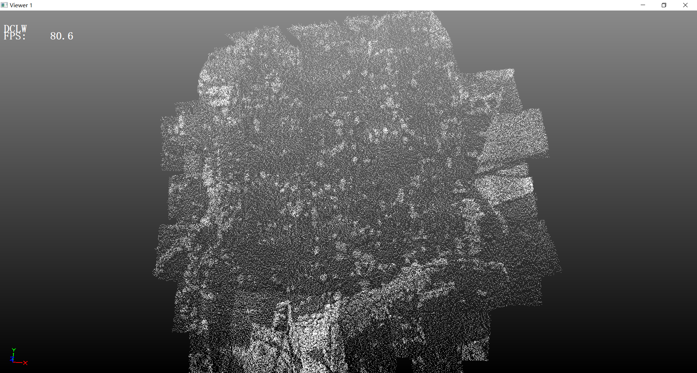
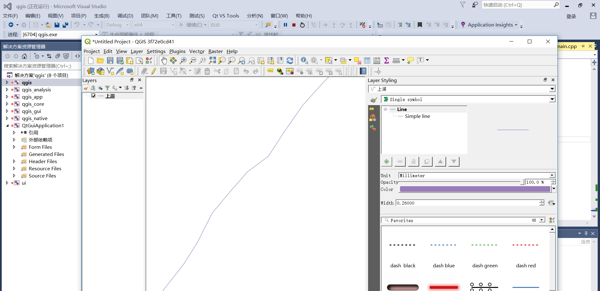

# 点云数据处理  
--------------
学习记录开源的资料，学习搭建基于激光雷达设备数据的点云浏览分析软件。一步步记录自己的搭建过程，基于opengGL、c++、Qt搭建
三维可视化引擎，同时基于webgl、js搭建web数据服务引擎   
    
## 主要思路
--------------
1、 UI界面通过Qt + xml | sqlite 配置文件搭建  
2、 VIEW可视化引擎基于opengl + glsl + qt，参考osg实现，支持shader的配置、漫游器的定义、操作器的定义  
3、 IO可视化引擎其实就是显示数据的，为了便于数据格式的支持，通过IO插件模式设计   
4、 MODULE，IO加载数据，VIEW可视化，UI提供交互，目标是做行业应用，通过插件模块化设计（Qt）支持c++和python，扩展ToolBox，  
    为了支持对切片数据的处理，toolbox的数据处理主要是针对原始文件，将结果切片可视化  
5、 TOOL，为了支持海量数据，需要将原始数据切片，所有IO支持的数据格式，可以使用系统的TOOL工具进行快速切片，以可视化

## 技术流程
--------------------
1、 针对每项UI | VIEW | IO | MODULE | TOOL涉及到的技术，先寻找并记录可用资源，学习后借鉴引进  
2、 先实现客户端工具，再扩展为web版

## 历程
1、 OnlyViewer项目预览图   


## VIEW
----------------
1、 学习opengl是怎么实现数据渲染的   
[openGL+GLSL](https://github.com/McNopper/OpenGL)  
[lighthouse3d](http://www.lighthouse3d.com/tutorials/glsl-tutorial/glsl-core-tutorial-index/)  
[中文GL](http://www.noie.name/tutorials/)  
[初级中级高级GL教程](http://www.opengl-tutorial.org/)   
2、 矩阵运算库  
[GLM](https://github.com/g-truc/glm)  实现矩阵运算  
```cpp
#include <glm/vec3.hpp> // glm::vec3
#include <glm/vec4.hpp> // glm::vec4
#include <glm/mat4x4.hpp> // glm::mat4
#include <glm/ext/matrix_transform.hpp> // glm::translate, glm::rotate, glm::scale
#include <glm/ext/matrix_clip_space.hpp> // glm::perspective
#include <glm/ext/constants.hpp> // glm::pi

glm::mat4 camera(float Translate, glm::vec2 const& Rotate)
{
	glm::mat4 Projection = glm::perspective(glm::pi<float>() * 0.25f, 4.0f / 3.0f, 0.1f, 100.f);
	glm::mat4 View = glm::translate(glm::mat4(1.0f), glm::vec3(0.0f, 0.0f, -Translate));
	View = glm::rotate(View, Rotate.y, glm::vec3(-1.0f, 0.0f, 0.0f));
	View = glm::rotate(View, Rotate.x, glm::vec3(0.0f, 1.0f, 0.0f));
	glm::mat4 Model = glm::scale(glm::mat4(1.0f), glm::vec3(0.5f));
	return Projection * View * Model;
}
```
[VCGlib](https://github.com/cnr-isti-vclab/vcglib)  网格数据结构， meshlab使用此库   

# 技术资料参考
## 算法库
pcl、cgal、gdal、pdal、geos    
[Convert massive pointcloud](https://github.com/NLeSC/Massive-PotreeConverter)   
## web引擎 
osgjs、cesium、optree、threejs、OpenSfM   
[Webgl pointcloud visualization of the Via Appia based on potree](https://github.com/NLeSC/PattyVis)  
[OpenSfM is a Structure from Motion library written in Python](https://github.com/mapillary/OpenSfM/blob/master/README.md)  
[potree.entwine.io](https://github.com/connormanning/potree.entwine.io)  
## 客户端引擎
cloudcompare、meshlab、visualiabary、vtk、osg、鬼火、DC-Points    
[osg框架设计](https://stackedboxes.org/2010/05/05/osg-part-2-statesets/)  
## cad & gis 
opencascad 、freecad、qcad、teigha、QGis 
   
[qgis debug编译](doc/build-qgis.md)
[geoserver/postgressql学习](doc/study-geoserver.md)
## UI
Qt
## 线程  
QThreadpool、 boost、[simple thread pool](https://github.com/progschj/ThreadPool)  
## 深度学习
[tensorflow](https://github.com/tensorflow/tensorflow)  
[tensorflow exam](https://github.com/hzy46/Deep-Learning-21-Examples)  
## 切片库
[entwine](https://entwine.io/)  
[lastool](https://rapidlasso.com/)  
## 公开数据  
[dronemapper](https://dronemapper.com/sample_data)  


